## [From Image-level to Pixel-level Labeling with Convolutional Networks](https://arxiv.org/pdf/1411.6228.pdf) (CVPR15)
C通道输出，Avg pooling/max pooling/LSE得C维向量（分类结果），用分类真值监督训练。

后处理：分割结果x分类结果、用Felzenszwalb’s超像素处理分割结果（每个超像素的标签是其中出现得最多的标签）、用BING得到方框和MCG得到的proposal计算每个像素的得分然后乘以分割结果，阈值判断得到标签。VOC miou 24.9

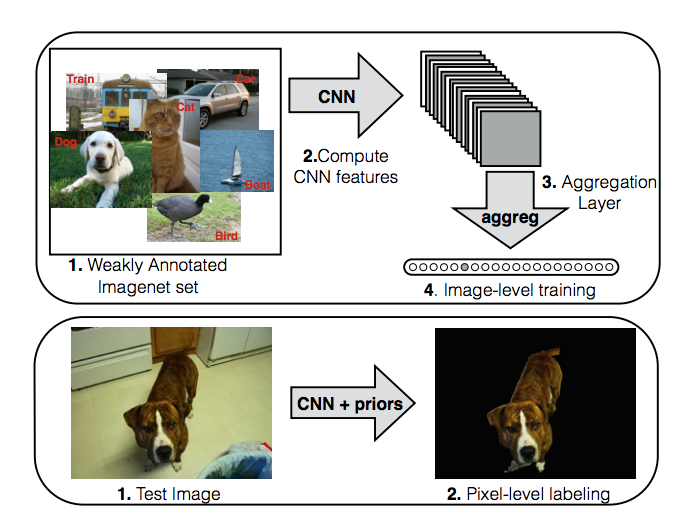

## [Seed, Expand and Constrain: Three Principles for Weakly-Supervised Image Segmentation](https://arxiv.org/pdf/1603.06098.pdf) (ECCV16)
seeding loss: 用CAM得到每个类别的种子区域、用显著性检测得到背景的种子区域，在种子区域的范围内最大化似然。expand loss: 分割结果经过他们提出来的一种池化得到分类结果，和分类真值计算损失。constrain loss: 分割结果和分割结果经过了CRF的结果的KL距离。voc val miou: 50.7

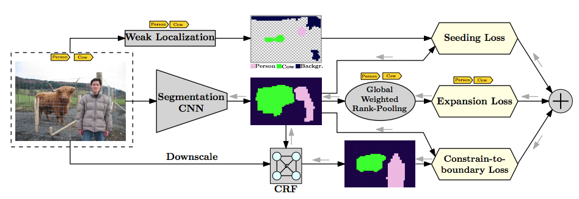

## [WILDCAT](http://webia.lip6.fr/~durandt/pdfs/2017_CVPR/Durand_WILDCAT_CVPR_2017.pdf) (CVPR17)
每个类产生M个通道的score map，然后先对通道平均再对空间平均，得到每个类的得分，用分类的真值训练。VOC val miou: 43.7

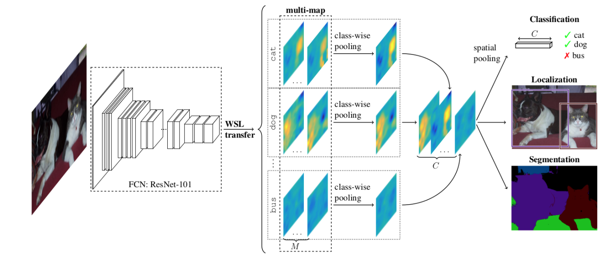

## [AE](https://arxiv.org/pdf/1703.08448.pdf) (CVPR17)
首先用CAM找出每个类的响应区域，每次都从输入图片里去除上次找出的区域再用CAM找出剩下的响应区域，重复几次得到初始分割结果。然后用初始分割结果乘以每个类的得分，用这个结果在训练分割。voc val 55.0

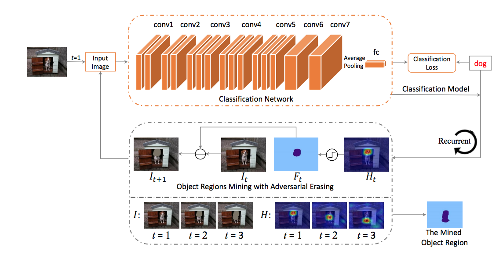

## [STC: A Simple to Complex Framework for Weakly-supervised Semantic Segmentation](https://arxiv.org/pdf/1509.03150.pdf) (PAMI17)
用DRFI saliency处理有类别标签的简单背景的图片（Flickr搜索得来），得到语义分割真值，训练语义分割模型。用语义分割模型处理只有类别标签的更复杂的图片，用预测结果再训练语义分割模型。voc val: 49.8

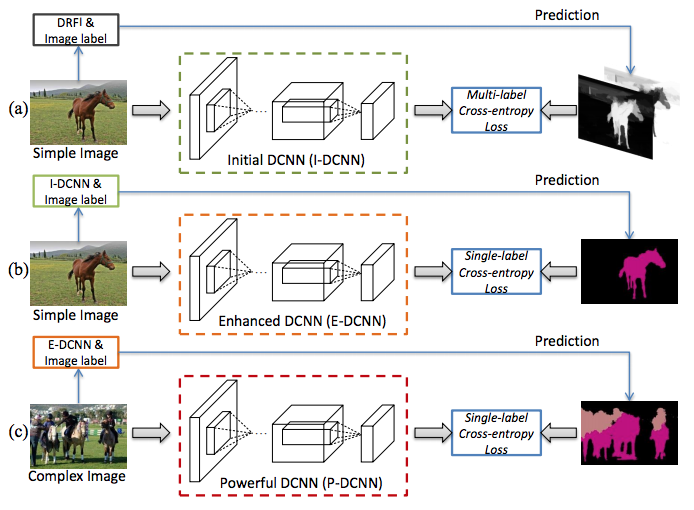

## [Learning Pixel-level Semantic Affinity with Image-level Supervision for Weakly Supervised Semantic Segmentation](https://arxiv.org/pdf/1803.10464.pdf) (CVPR18)
用CAM得到每个类的响应区域并且用denseCRF处理。选每个类的可信度较高的像素训练网络预测每个像素和它附近像素的相似性：属于同一类就输出1，不同类输出0。用得到的相似性矩阵经过归一化后乘以CAM作为propagation。经过propagation的CAM用来再训练一个分割网络。
voc val: 61.7

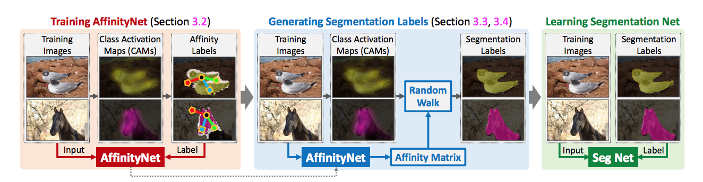

## [Exploiting Saliency for Object Segmentation from Image Level Labels](https://arxiv.org/pdf/1701.08261.pdf) (CVPR17)
分割网络输出的结果经过avg pooling产生分类分数，用分类真值训练。用训练好的saliency模型处理训练数据得到前景mask，1)随机给前景mask一个这个图片里有的类别标签，或者2)把图片分割成超像素，每个超像素的区域置0再输入训练好的分割/分类网络，和原图输入产生的结果相比分数差别最大的那个类作为这个区域的标签，据此得到分割真值。用产生的真值训练分割网络。voc val 55.7

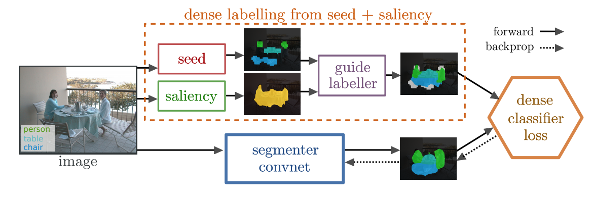

## [Weakly-Supervised Semantic Segmentation Network with Deep Seeded Region Growing](http://openaccess.thecvf.com/content_cvpr_2018/papers/Huang_Weakly-Supervised_Semantic_Segmentation_CVPR_2018_paper.pdf) (CVPR18)
用CAM得到每个类的响应区域，用显著性检测方法得到背景区域。把每个类别分数大于阈值的区域作为种子，然后用seed growing的方法分类其他区域。用得到的结果作为真值监督训练分割网络。voc val 61.4

## [Adversarial Complementary Learning for Weakly Supervised Object Localization](https://arxiv.org/pdf/1804.06962v1.pdf) (CVPR18)
并行的AE。没给VOC结果，在imagenet object localization实验

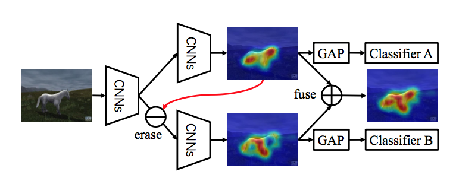

## [Revisiting Dilated Convolution: A Simple Approach for Weakly- and SemiSupervised Semantic Segmentation](https://arxiv.org/pdf/1805.04574.pdf) (CVPR18)
用扩张量不同的卷积分别得到分割结果，做avg pooling得到分类结果，用分类真值监督。不同扩张量产生的分割结果平均，用显著性检测得到背景区域。用分割结果监督训练分类网络。voc val 60.4

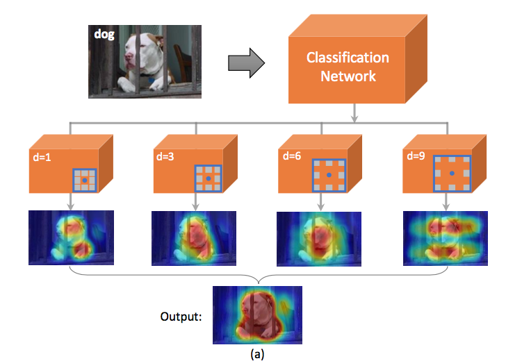

## [Weakly-Supervised Semantic Segmentation by Iteratively Mining Common Object Features](https://arxiv.org/pdf/1806.04659v1.pdf) (CVPR18)
用CAM产生每个类别的区域，用显著性检测得到背景区域。图片分割成超像素，对于每个类，把所有训练图片里这个类的超像素作为训练样本，训练一个给超像素分类的网络。用这个网络的结果训练分割网络，在用分割网络的结果训练超像素分类网络。迭代。VOC val 60.3

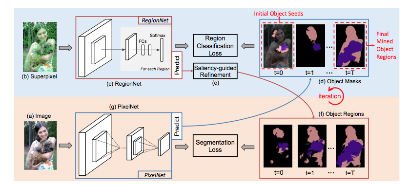

## [Associating Inter-Image Salient Instances for Weakly Supervised Semantic Segmentation](http://openaccess.thecvf.com/content_ECCV_2018/papers/Ruochen_Fan_Associating_Inter-Image_Salient_ECCV_2018_paper.pdf) (ECCV18)
用CAM产生每个像素属于每个类别的概率，用instance saliency方法产生salient instance（方框和框内物体的mask），根据CAM的结果得到每个实例属于每个类的概率。用上述流程在整个训练集上运行得到实例。用所有的实例构造相似图、传播CAM得到的结果。再用得到的结果训练语义分割的网络。VOC val 64.5

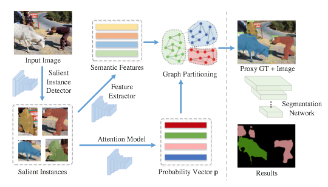
